# Jarkom_Modul1_2025_k41


|nama kelompok                | nrp         |
|-----------------------------|-------------|
| Balqis Sani Sabillah        |  5027241002 |   
| Alnico Virendra Kitaro Diaz |  5027241081 |

## Soal no 1 ##
Untuk mempersiapkan pembuatan entitas selain mereka, Eru yang berperan sebagai Router membuat dua Switch/Gateway. Dimana Switch 1 akan menuju ke dua Ainur yaitu Melkor dan Manwe. Sedangkan Switch 2 akan menuju ke dua Ainur lainnya yaitu Varda dan Ulmo. Keempat Ainur tersebut diberi perintah oleh Eru untuk menjadi Client.


## Soal no 2 ##
Karena menurut Eru pada saat itu Arda (Bumi) masih terisolasi dengan dunia luar, maka buat agar Eru dapat tersambung ke internet.

step : 
- apt update && apt install iptables -y
- iptables -t nat -A POSTROUTING -o eth0 -j MASQUERADE -s 10.84.0.0/16
- cat /etc/resolv.conf
- echo nameserver 192.168.122.1 > /etc/resolv.conf


## Soal no 3 ##
Sekarang pastikan agar setiap Ainur (Client) dapat terhubung satu sama lain.

- gunakan ip a


## Soal no 4 ##
Setelah berhasil terhubung, sekarang Eru ingin agar setiap Ainur (Client) dapat mandiri. Oleh karena itu pastikan agar setiap Client dapat tersambung ke internet.

- melkor


- manwe


- varda


- ulmo


## Soal no 5 ##

gunakan :
- nano .bashrc
lalu copy dan paste ke bagian paling bawah


## Soal no 14 ##
Setelah gagal mengakses FTP, Melkor melancarkan serangan brute force terhadap  Manwe. Analisis file capture yang disediakan dan identifikasi upaya brute force Melkor. 
[link file](https://drive.google.com/drive/folders/13rf0AlzUrkNhUWbBNt9tIVSimw3njKqd) nc 10.15.43.32 3401

### Jawaban ###
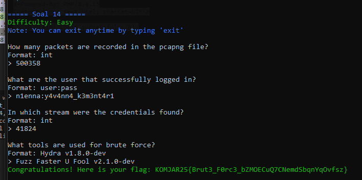 

A. Terdapat 50038 packet  

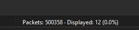 

B. Pilih Packet HTTP karena biasanya memuat username, namun tdk selalu maka lakukan pengecekan dengan klik kanan -> Follow -> HTTP Stream    
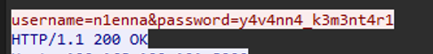 

c. Dipacket yg sama terdapat kolom Stream di bagian kanan bawah  
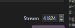   

d. Di dalam Packet yang sama terdapat user-agent yang memuat tools apa yang digunakan   
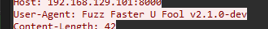  

## Soal no 15 (REVISI) ##
Melkor menyusup ke ruang server dan memasang keyboard USB berbahaya pada node Manwe. Buka file capture dan identifikasi pesan atau ketikan (keystrokes) yang berhasil dicuri oleh Melkor untuk menemukan password rahasia.
[link file](https://drive.google.com/drive/folders/1aHSRMoEgQBsA-4I2wWatFxAy3laumcgb) nc 10.15.43.32 3402

### Jawaban ###


A. Mengindentifikasi di packet - packet


B. membuat 3 file dalam 1 folder file hidden.py hiddenmsg.pcapng pyhton.py, lalu di decode menggunakan command berikut : 

``` python3 CTF-Usb_Keyboard_Parser/Usb_KeyBoard_Parser.py hiddenmsg.pcap  ```

   

c. Kita ubah base 64 ke teks

   

## Soal no 16 ##
Melkor semakin murka ia meletakkan file berbahaya di server milik Manwe. Dari file capture yang ada, identifikasi file apa yang diletakkan oleh Melkor.
[link file](https://drive.google.com/drive/folders/1aJf_PQGXwr4fxd79df8nd7NzL7SsN6U9) nc 10.15.43.32 3403

### Jawaban ###
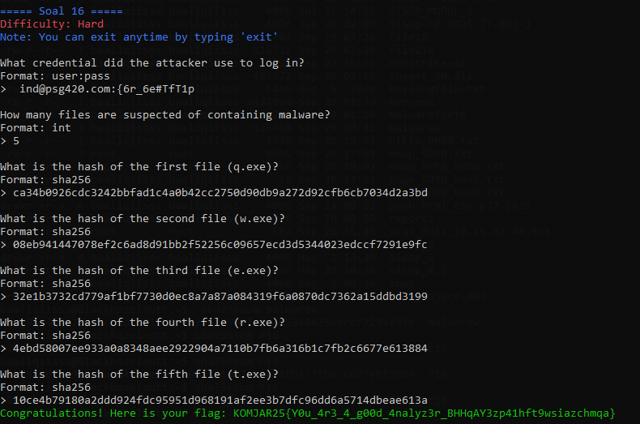      

A. Cari Packet FTP karena biasanya sebagai tempat login, sehingga bisa memuat username dan password client  
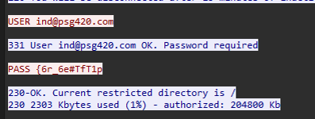    

B. Salah satu ciri - ciri file malware adalah .exe dan terdapat 5 file dengan akhiran .exe ( q.exe, w.exe, e.exe, r.exe, t.exe )  
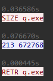     

C. Untuk mengintegritaskan file FTP-DATA ( q.exe, w.exe, e.exe, r.exe, t.exe) dengan **sha256sum** maka kita harus mengsave file packet dengan row agar dapat menyimpan payload benar - benar apa adanya (bit by bit)  
bash : sha256sum <namafile>

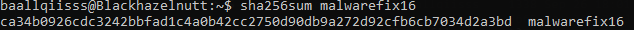    

D. 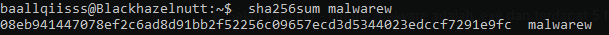    

E. 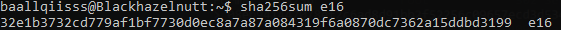  

F.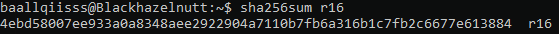   

G. 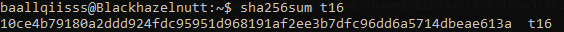  

## Soal no 17 ##
Manwe membuat halaman web di node-nya yang menampilkan gambar cincin agung. Melkor yang melihat web tersebut merasa iri sehingga ia meletakkan file berbahaya agar web tersebut dapat dianggap menyebarkan malware oleh Eru. Analisis file capture untuk menggagalkan rencana Melkor dan menyelamatkan web Manwe.
[link file](https://drive.google.com/drive/folders/10UNx8BhvbyCDhHGHS7D7zmyvFbCf41ze) nc 10.15.43.32 3404

### Jawaban ###
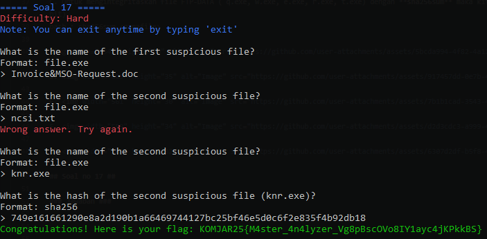  

A. Untuk menemukan suspicius file yaitu pergi ke file -> Export Object -> HTTP
   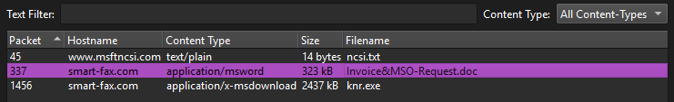    
B.
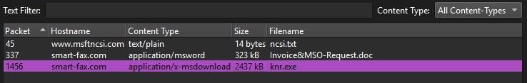    

C. Sama seperti diatas, kita harus mensave file knr.exe dulu
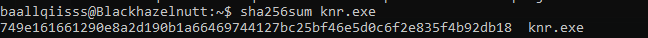  

## Soal no 18 ##   
Karena rencana Melkor yang terus gagal, ia akhirnya berhenti sejenak untuk berpikir. Pada saat berpikir ia akhirnya memutuskan untuk membuat rencana jahat lainnya dengan meletakkan file berbahaya lagi tetapi dengan metode yang berbeda. Gagalkan lagi rencana Melkor dengan mengidentifikasi file capture yang disediakan agar dunia tetap aman.
[link file](https://drive.google.com/drive/folders/1R4-D1WnsDVrT73UlkacjY0Ntag42AFUy) nc 10.15.43.32 3405

### Jawaban ### 
     

A. Untuk melihat file berisi malware yaitu pergi ke file -> Export Object -> SMB, nahh ciri - ciri file malware biasanya ada .exe nahh disini ada 2 file     
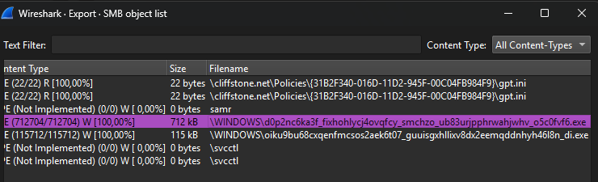    

B. File ke 2 

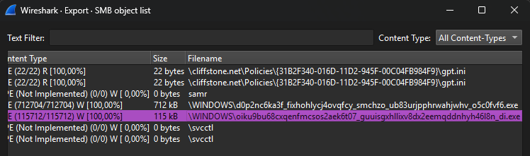  

C.   
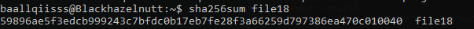   

D. 
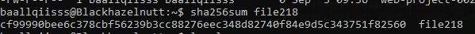   


## Soal no 19 ##
Manwe mengirimkan email berisi surat cinta kepada Varda melalui koneksi yang tidak terenkripsi. Melihat hal itu Melkor sipaling jahat langsung melancarkan aksinya yaitu meneror Varda dengan email yang disamarkan. Analisis file capture jaringan dan gagalkan lagi rencana busuk Melkor.
[link file](https://drive.google.com/drive/folders/1D6d8EYdIvE8UF_i4Ms0C7Yakd9j0GYBN) nc 10.15.43.32 3406

### Jawaban ###
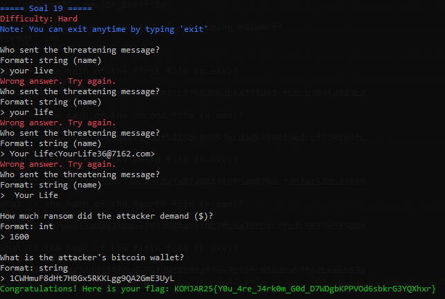    

A. Disini saya pilih packet yg bawah bawah karena biasanya informasinya itu lebih lengkap  
  

B. Di packet yang sama sudah terdapat informasi yang tertulis  
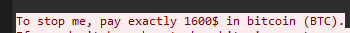  

C. Di packet yang sama sudah terdapat informasi yang tertulis   
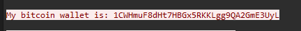  

## Soal no 20 ##
Untuk yang terakhir kalinya, rencana besar Melkor yaitu menanamkan sebuah file berbahaya kemudian menyembunyikannya agar tidak terlihat oleh Eru. Tetapi Manwe yang sudah merasakan adanya niat jahat dari Melkor, ia menyisipkan bantuan untuk mengungkapkan rencana Melkor. Analisis file capture dan identifikasi kegunaan bantuan yang diberikan oleh Manwe untuk menggagalkan rencana jahat Melkor selamanya.
[link file](https://drive.google.com/drive/folders/1wOe76_DgH087tAaHH_jxsHCinwFv9pmT) nc 10.15.43.32 3407

### Jawaban ###
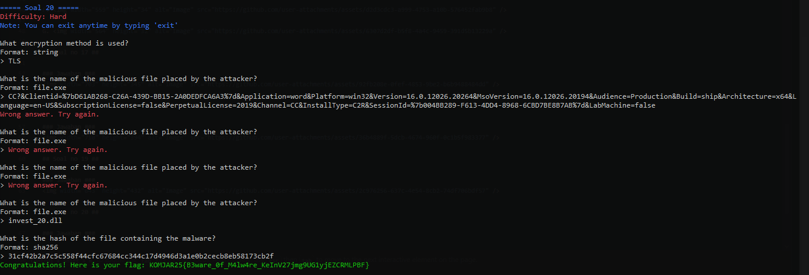  

A. Jawabannya TLS karena di Wireshark terlihat protokol yang digunakan adalah TLSv1.2. TLS sendiri berfungsi mengenkripsi komunikasi (misalnya HTTP → HTTPS), sehingga data tidak terkirim dalam bentuk plain text. Jadi, encryption method yang dipakai dalam capture ini adalah TLS.
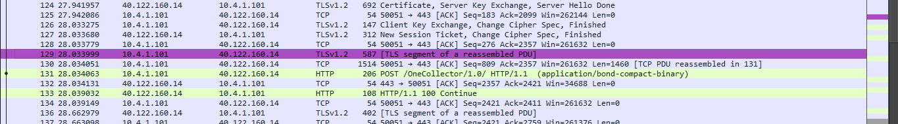  

B. Nahh disini kita memerlukan file [keyslogfile.txt](https://drive.google.com/drive/folders/1wOe76_DgH087tAaHH_jxsHCinwFv9pmT), untuk membuka file tersembunyi yaitu dengan cara : 
- Edit -> Preferences -> Protocol -> TLS -> Masukkan *keyslogfile.txt* -> Apply
nahh baru disini keluar semua isi file tersembunyi di
- File ->  Export Objects -> HTTP  
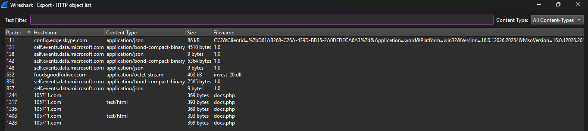  

C. 
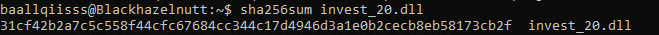  


